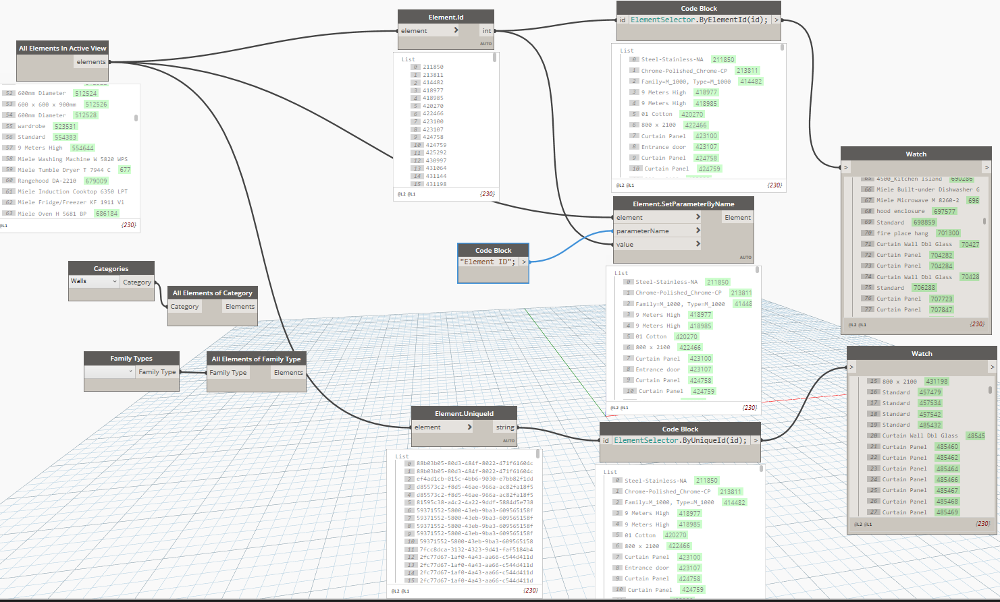
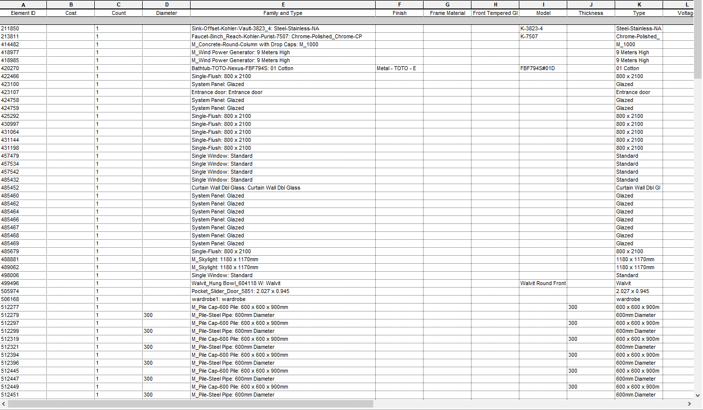
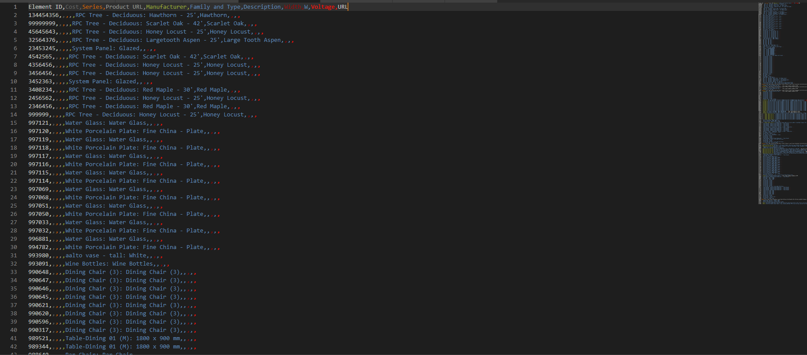

# Real Time BIM

Project source files and a throrough workflow to get both BIM geometry and metadata to Unity Engine (or any other engine) for Real Time applications

## Getting Started

These instructions will get you a copy of the project up and running on your local machine for development and testing purposes. See deployment for notes on how to deploy the project on a live system.

If all you want to do is test the application, all that is needed is to run the RTS application under the Builds folder, connect an Arduino connected to two MQ-2 smoke sensors while reading on the analog pins A0 and A0 then compile and upload the Arduino.c script located on the Assets/Scripts folder. The readings should appear if you run the scene after having the circuit connected.

### Prerequisites

[Autodesk Revit](https://www.autodesk.com/products/revit/overview)

[Unity Engine](https://unity3d.com/pt) ([Unreal Engine](https://www.unrealengine.com/en-US/what-is-unreal-engine-4) also works by rewriting the MenuMetaData script into C++)

[Dynamo](http://dynamobim.org/) (Not necessary but really recommended)

There are .NET dependencies, however the project should work for both 2.0 (for Linux users) and 4.5 and later (for Windows and OS X users).

## Workflow

To extract the metadata, the first step is that of creating a way of identifying any BIM component that the scene consists of, and thus a new project parameter called <b>Element ID</b> should be created. After which, said element should be made explicit, the manner in which is entirely up to the user, but in this case, a Dynamo visual script was used, with the pointer set to an open revit scene. The view which the user wants to made the BIM database of should also be made explicit.

<br>
<p>


</p>
<center>
<i> 
Figure 1: General overview of the Dynamo Script to assign an Element ID to everything contained in a view.
</i>
</center>
<br>

After that is done, the next step is creating a multi-variable Schedule on Revit, picking the Element ID which will serve as a guide later when we decide to attribute a metadata component to game objects down the line. After specifying the desired information you consider relevant among the pool of metadata available, you can create a schedule. The end resoult should end up looking something like the results presented in Figure 2.

<br>
<p>


</p>
<center>
<i> 
Figure 2: Schedule to be exported.
</i>
</center>
<br>

After exporting the Schedule (ideally as a CSV file), you can export the geometry (keep all the elements separated). This process is already [well documented](https://knowledge.autodesk.com/support/revit-products/learn-explore/caas/beta/CloudHelp/cloudhelp/2016/ENU/Revit-DocumentPresent/files/GUID-C8038EFE-FB14-4591-85A1-8407B2BDDD0A-htm.html), and not really a part of our scope. In posession of an FBX model, and a CSV table similar to Figure 3, you can then move on to the next step, on the game engine.

<br>
<p>

</p>
<center>
<i> 
Figure 3: Schedule to be turned into metadata.
</i>
</center>
<br>

After that is all done, you can use the MenuMetaData script on an Editor level. As soon as you turn the script active it'll assign the metadata component to the objects containing their respective IDs.

```cs
    public string filePath = "/MetaData/";
    public string fileName = "Metadata";
    public string fileExtension = "csv";
```

By editing these variables, the parser will know where to look for the metadata file. Ideally this should be done before a project is built. As the operation is demanding on resources, and it will slow down startup especially on larger project with thousands of unique components.

The project at hand also has another set of parsers, scripts for reading serial input on a computer's COM ports, scripts for allowing free movement on the scene and much else that are not a part of the workflow but would make themselves relevant when implementing other features for future applications.

## Running the tests

For an initial implementation, we'll be reading from the arduino A0 and A1 pins, and displaying that information on screen. For that you can upload the following script into your Arduino:

```c

#define SERIAL_USB
int redLed = 12;
int greenLed = 11;
int smokeA0 = A0;
int smokeA1 = A1;
int aux = 0;
//threshold value
int sensorThres = 350;
String data;
String holder;
void setup() {
#ifdef NATIVE_USB
  Serial.begin(1); //Baudrate is irevelant for Native USB
#endif
  pinMode(redLed, OUTPUT);
  pinMode(greenLed, OUTPUT);
  pinMode(smokeA0, INPUT);
  pinMode(smokeA1, INPUT);
#ifdef SERIAL_USB
  Serial.begin(50000); //you can choose any baudrate, just need to also change it in Unity.
  while (!Serial); //wait for Leonardo enumeration, others continue immediately
#endif
}

void loop() {
  if (aux == 0) {
    holder = "1,";
    data = holder + analogRead(smokeA0);
    sendData(data);
    ++aux;
  }
  else
  {
    holder = "2,";
    data = holder + analogRead(smokeA1);
    sendData(data);
    --aux;
  }
  if (analogRead(smokeA0) > sensorThres || analogRead(smokeA1) > sensorThres)
  {
    digitalWrite(redLed, HIGH);
    digitalWrite(greenLed, LOW);
  }
  else
  {
    digitalWrite(redLed, LOW);
    digitalWrite(greenLed, HIGH);
  }
  delay(10); //choose your delay having in mind your ReadTimeout in Unity3D
}

void sendData(String data) {
#ifdef NATIVE_USB
  Serial.println(data); //need an end-line because wrmlh.csharp use readLine method to receive data
#endif

#ifdef SERIAL_USB
  Serial.println(data); //need an end-line because wrmlh.csharp use readLine method to receive data
#endif
}

```

After that, you may open the Unity Editor and pick the COM port being used. It must match that of the Arduino connected to the computer (standard is COM3). After setting up the scene, you can just press play, after which the result should be similar to what is seen on Figure 4:

<br>
<p>

</p>
<center>
<i> 
Figure 4: Schedule to be turned into metadata.
</i>
</center>
<br>

After all that is finished, the entire development pipeline should be clear, this can easily be modified to fit any necessity, both in regards to BIM as well as regarding real time monitoring of both structure and environment conditions. Both have been shown to be made available for real time applications. How they would interact would rely solely on the demands made of the software and on the manners in which information will be handled.

## Deployment

A companion application for monitoring the very same data but through a web application is also available to show that the monitoring may be distributed between multiple devices.

In this case deployment was made for real-time virtual monitoring of a real enviroment with BIM metadata for the purposes of detecting gas leaks and excess smoke in different rooms inside a private residence. Larger projects are yet to be implemented.

## Authors

* **Pedro Almeida** - *Initial work* - [Lattes](http://lattes.cnpq.br/8656611810548195)

No contributors so far.


## Acknowledgments

Thanks to the [wrmhl](https://github.com/relativty/wrmhl) project, their code to read arduino data into unity was adapted to work on .NET 4.5.

Original idea stemmed from [this](https://www.youtube.com/watch?v=fZ-19ashzKI) particular keynote from Unite Tokyo.
